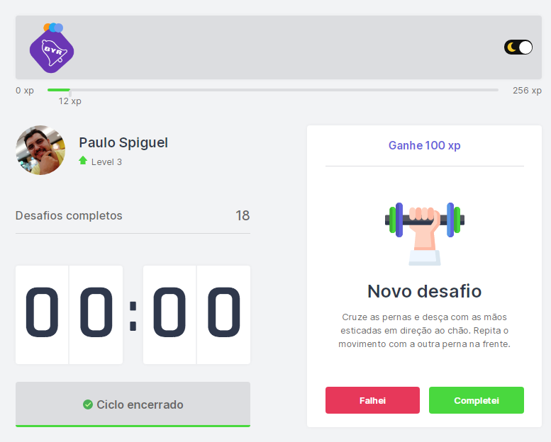
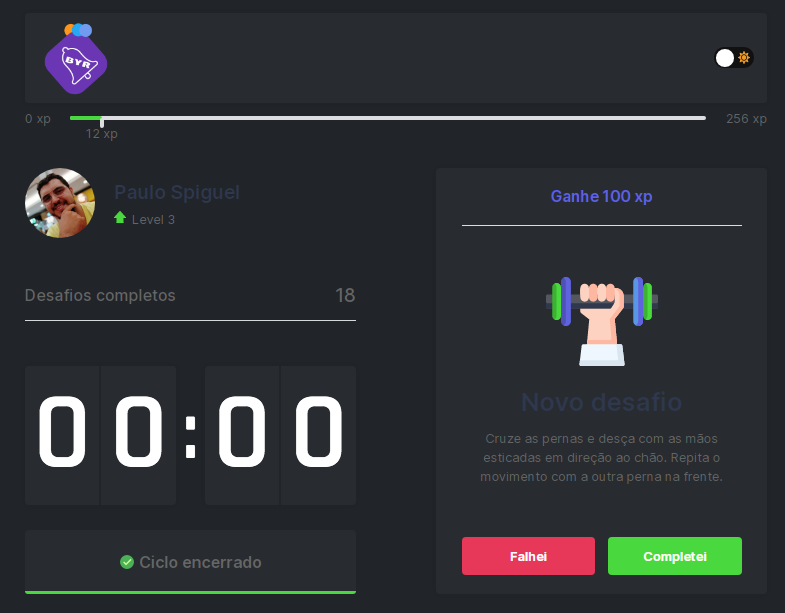
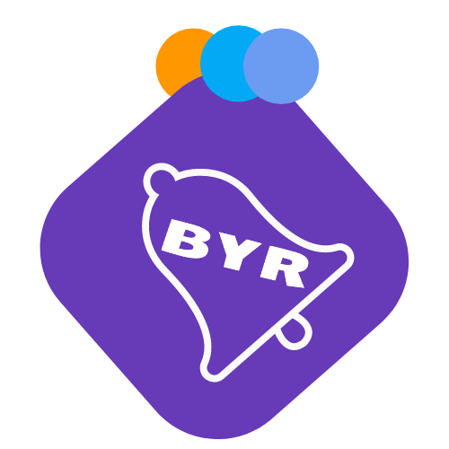

<h1 align="center">
    
</h1>

<strong>Modo Light</strong>

<h1 align="center">
    
</h1>

<strong>Modo Light</strong>

<p align="center">
  <a href="#technologies">Technologies</a>&nbsp;&nbsp;&nbsp;|&nbsp;&nbsp;&nbsp;
  <a href="#-preview">Preview</a>&nbsp;&nbsp;&nbsp;|&nbsp;&nbsp;&nbsp;
  <a href="#-layout">Getting started</a>&nbsp;&nbsp;&nbsp;|&nbsp;&nbsp;&nbsp;
  <a href="#-project">Project</a>&nbsp;&nbsp;&nbsp;|&nbsp;&nbsp;&nbsp;
  <a href="#-layout">Layout</a>&nbsp;&nbsp;&nbsp;|&nbsp;&nbsp;&nbsp;
  <a href="#-license">License</a>
</p>

<p align="center">
  

  

  
</p>

<br>

<p align="center">
  
</p>

## 🧪 Why the name ByrApp?

Byr is a word derived from the Tupí language of the Brazilian Indians and means, to get up, to move.

## 🧪 Technologies

This project was developed using the following technologies:

- [Next.js](https://nextjs.org/)
- [React](https://reactjs.org)
- [TypeScript](https://www.typescriptlang.org/)
- [Styled-Components](https://styled-components.com/)

## 🔥 Preview

[](https://byr-app.vercel.app/)

## 🚀 Getting started

Clone the project and access the folder

```bash
$ git clone git@github.com:PauloSpiguel/nlw4_byr-app.git && cd nlw4_byr-app
```

Follow the steps below
```bash
# Install the dependencies
$ yarn

# Start the project
$ yarn dev
```

## 💻 Project

[Byr-App](https://byr-app.vercel.app/) came to remind you to exercise always! 💜

This is a project developed during the **[Next Level Week](https://nextlevelweek.com/)**, presented by **[@Rocketseat](https://github.com/Rocketseat)** during February 22-28, 2021.

## 🔖 Layout

You can view the project layout through the links below:

- [Layout Web 1.0](https://www.figma.com/file/ge20pu3ofMOKoliUyKx1Nl/Move.it-1.0)
- [Layout Web 2.0](https://www.figma.com/file/7tXndNnentETZjBt4MEeU3/Move.it-2.0-Copy)

Remembering that you need to have a [Figma](http://figma.com/) account to access it.

## 📝 License

This project is licensed under the MIT License. See the [LICENSE](LICENSE.md) file for details.


---

<p align="center">Made with 💜 by Paulo Spiguel</p>
